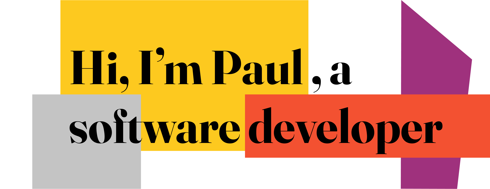

## 

Hi there 👋 I'm Paul. After graduating with a degree in Chemical Engineering I soon started a career in manufacuting and supply chain management. Whilst I loved the rush of operations I missed the problem solving and technical challenge of Engineering, I also saw the fantastic possibilities for how technology was quickly changing our world and uncovered a passion for design 🎨.

So in January 2022 I took the jump 🪂 and joined the _nology.io consultancy programme as a junior full stack software developer and have loved every minute of it. 

Check out my portfolio here: https://singapaul.github.io/portfolio/

 

## Connect with me

 
 

## Skills 

# Blog posts
<!-- BLOG-POST-LIST:START -->
- [Bootcamp week 9: What do hammers, parking lots and libraries have in common?](https://medium.com/@paulmichaelhardman/bootcamp-week-9-what-do-hammers-parking-lots-and-libraries-have-in-common-c995d56e4ff3?source=rss-abcfe04287f6------2)
- [Bootcamp week 8: Java, imposter syndrome and why I’m in tech.](https://medium.com/@paulmichaelhardman/bootcamp-week-8-java-imposter-syndrome-and-why-im-in-tech-931e8aacd18?source=rss-abcfe04287f6------2)
- [Bootcamp week 7: &lpar;Professionalism, APIs &amp; Testing&rpar; Redux.](https://medium.com/@paulmichaelhardman/bootcamp-week-7-professionalism-apis-testing-redux-e16cac0d8832?source=rss-abcfe04287f6------2)
- [Bootcamp Week 6: Halftime](https://medium.com/@paulmichaelhardman/bootcamp-week-6-halftime-95886fb10402?source=rss-abcfe04287f6------2)
- [Hack your creativity and productivity in 5 seconds](https://medium.com/@paulmichaelhardman/hack-your-creativity-and-productivity-in-5-seconds-3826171ee0c8?source=rss-abcfe04287f6------2)
<!-- BLOG-POST-LIST:END -->

