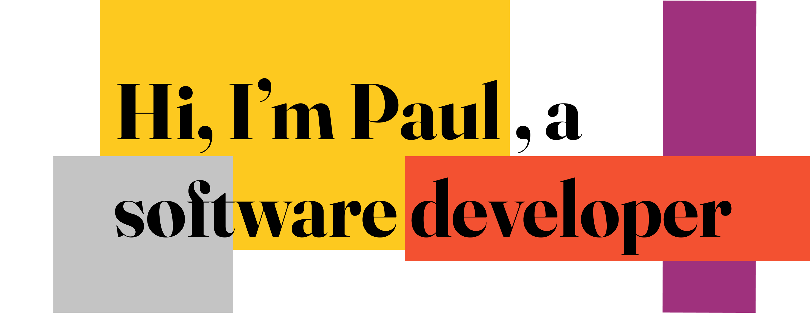

<!--
**singapaul/singapaul** is a ✨ _special_ ✨ repository because its `README.md` (this file) appears on your GitHub profile.

Here are some ideas to get you started:

- 🔭 I’m currently working on ...
- 🌱 I’m currently learning ...
- 👯 I’m looking to collaborate on ...
- 🤔 I’m looking for help with ...
- 💬 Ask me about ...
- 📫 How to reach me: ...
- 😄 Pronouns: ...
- ⚡ Fun fact: ...
-->

## 

Hi there 👋 I'm Paul. After graduating with a degree in Chemical Engineering I soon started a career in manufacuting and supply chain management. Whilst I loved the rush of operations I missed the problem solving and technical challenge of Engineering, I also saw the fantastic possibilities for how technology was quickly changing our world and uncovered a hidden passion for design 🎨.

So in January 2022 I took the jump 🪂 and joined the _nology.io consultancy programme as a junior full stack software developer and have loved every minute of it. 

Check out my portfolio here: https://singapaul.github.io/portfolio/

 

Connect with me

 
 

Skills 

